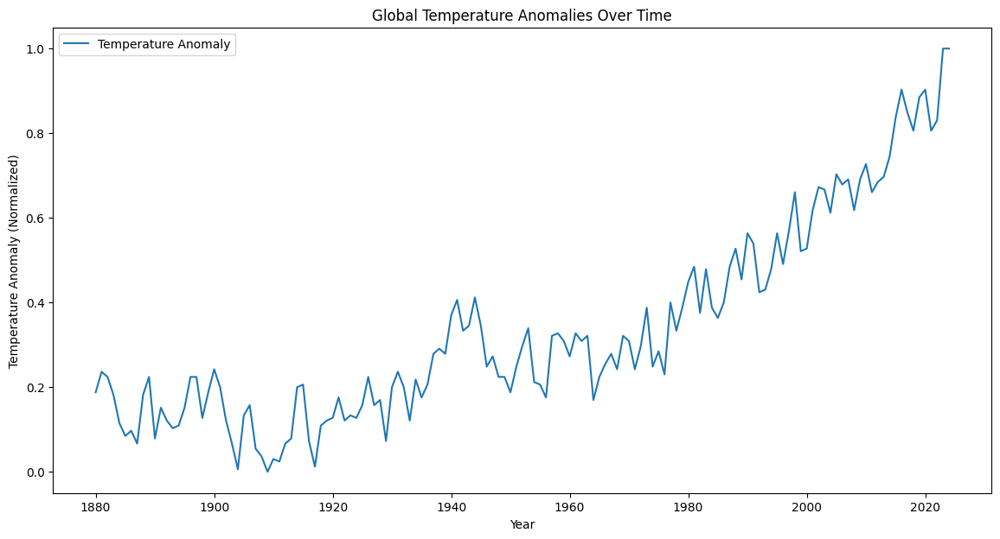
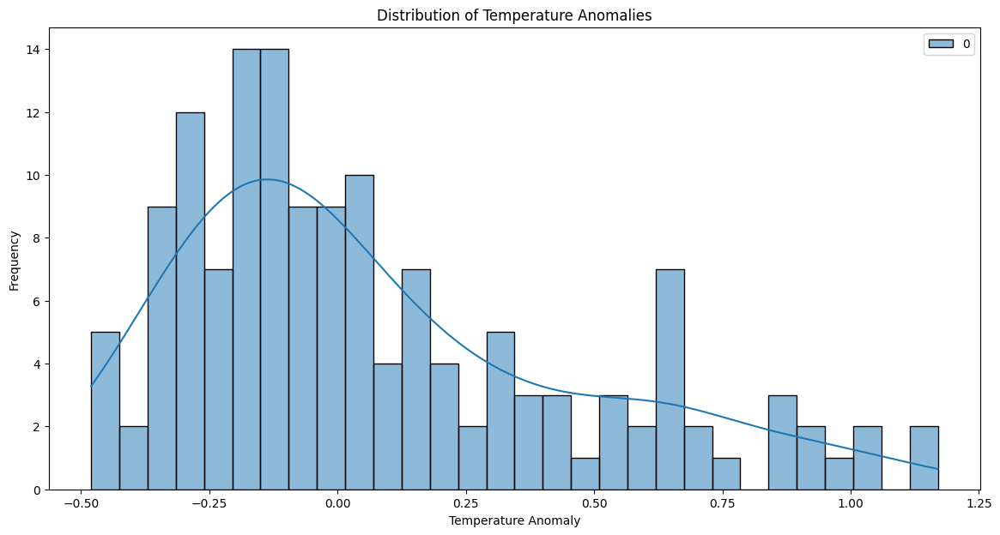
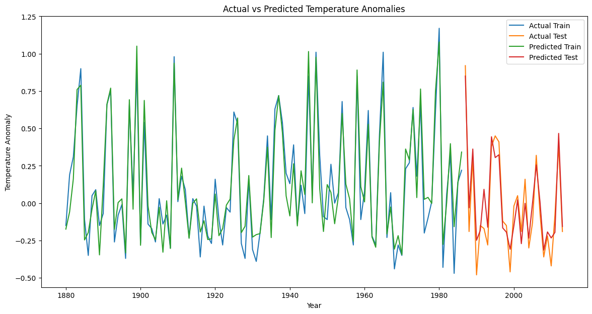
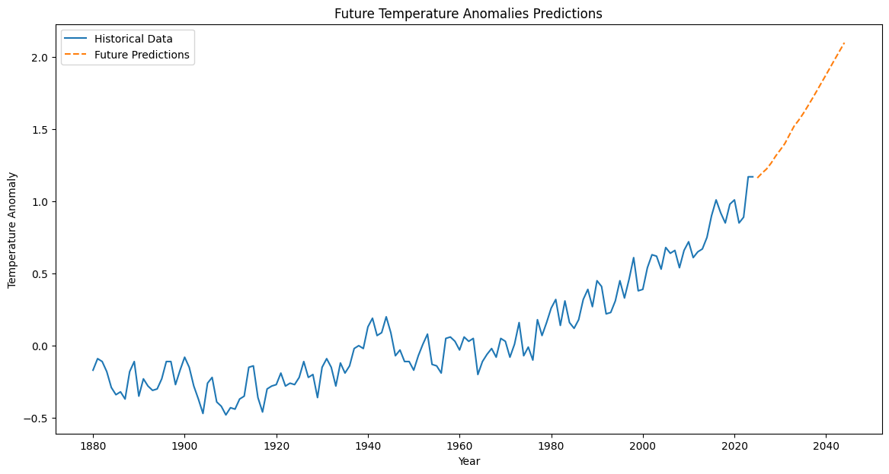

# Temperature Anomaly Analysis
This repository contains a project that predicts global temperature anomalies using an LSTM neural network. The dataset used is from NASA GISTEMP.

## Dataset
The dataset used in this project is the NASA GISTEMP dataset. It can be accessed directly from [NASA GISTEMP](https://data.giss.nasa.gov/gistemp/).

### Features
- **Year**: The year of the temperature anomaly measurement.
- **Temperature Anomaly**: The temperature anomaly for the given year, relative to a baseline period.

## Requirements
- Python 3.6+
- pandas
- numpy
- matplotlib
- seaborn
- scikit-learn
- tensorflow

## Exploratory Data Analysis
The project starts with an exploratory data analysis (EDA) to understand the trends and distribution of temperature anomalies. Key steps include:
- Loading and preprocessing the data.
- Visualizing the time series of temperature anomalies.
- Analyzing the distribution of temperature anomalies.

### Time Series Plot

### Distribution of Temperature Anomalies

## Model Building
The primary model used in this project is an LSTM neural network built using TensorFlow and Keras. The model architecture consists of:
- An LSTM layer with 50 units and return sequences.
- Another LSTM layer with 50 units.
- A Dense layer with 1 unit for the output.

## Model Evaluation
The model is evaluated using the following metrics:
- Mean Absolute Error (MAE)
- Root Mean Squared Error (RMSE)

### Actual vs Predicted Values

## Future Predictions
The model is also used to make future predictions of temperature anomalies for the next 20 years.

### Future Predictions

## Conclusion and Future Work
### Conclusion
- The LSTM model showed a reasonable performance in predicting the global temperature anomalies.
- The Mean Absolute Error (MAE) and Root Mean Squared Error (RMSE) indicate the average magnitude of errors in the predictions.

### Future Work
- Incorporate more advanced models or hybrid models for better performance.
- Collect more data to improve the robustness of the models.
- Apply the model to regional temperature anomaly data for localized predictions.
- Conduct hyperparameter tuning to further optimize the model performance.
